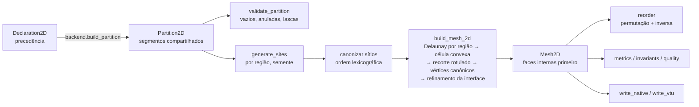
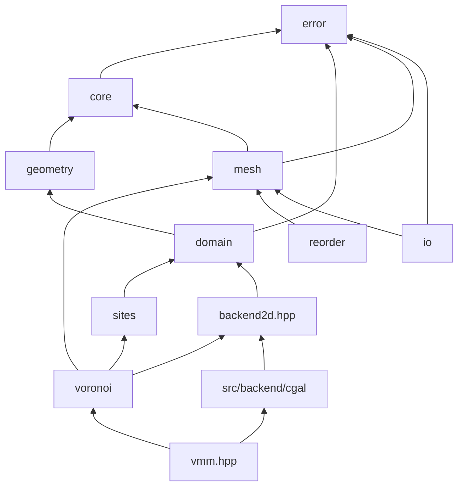

# P06 — Arquitetura da entrega (a)

- **Data:** 2026-09-29
- **Sequência:** v5.2, prompt P06
- **Ambiente:** documental; ferramentas verificadas no WSL `Ubuntu-26.04-Test` (g++ 15.2 e 14, CMake 4.2.3, CGAL 6.2.1, Boost 1.92, GoogleTest 1.17, gcovr, doxygen, sphinx 8.2.3, breathe 4.36). Ausentes: clang, OpenFOAM, pydata-sphinx-theme, sphinx-gallery, pyvista.
- **Entradas:** requisitos, P01–P05, P05a, `DECISIONS.md` até a DEC-030.
- **Convenção:** **[F]** fato verificado · **[I]** inferência · **[R]** recomendação.
- **Natureza:** sem código. As decisões abaixo são a base obrigatória de P07–P14.

---

## 1. Princípios herdados

| Fonte | Consequência na arquitetura |
|---|---|
| DEC-007, R19, R20 | `vmm_core` não conhece o CGAL. O backend chega ao núcleo como um `struct` de callables (composição, sem `virtual`), montado pela camada de fachada. `Real = double`. |
| DEC-011, P05a | Topologia **por rótulos** propagados pelo backend. Vértices recalculados de forma canônica a partir dos rótulos; nenhuma decisão topológica por distância. |
| DEC-028 | Interface: Voronoi por região + refinamento comum (E1). Pares espelhados (E2) são uma política opcional de sítios. |
| DEC-029, DEC-030 | Faces internas primeiro (ordem triangular superior por owner/neighbour), depois as de fronteira agrupadas por patch. Sem OpenFOAM. |
| DEC-018 | Declaração por precedência → partição explícita com segmentos compartilhados → validador. |
| DEC-016, R10, R11 | `Result<T> = std::expected<T, Error>`; `vmm::Exception` só para violação de invariante interno (bug). |
| DEC-020, R17, R18 | Tolerâncias relativas a L; sítios canonizados na entrada (ordem lexicográfica), o que torna a saída independente da ordem de inserção **bit a bit**. |
| R3, DEC-024 | Sem virtual, herança ou enum de despacho; policies por template/concept e registros abertos. |

## 2. Estrutura nova e alvos

A estrutura nova nasce em `vmm/`, ao lado da `VMMLib/`, que continua compilando como oráculo até a retirada (DEC-011).

```
vmm/
  CMakeLists.txt
  include/vmm/
    vmm.hpp                 fachada: generate_mesh_2d(), cgal_backend_2d()
    core/     types.hpp csr.hpp tolerance.hpp random.hpp
    error/    error_code.hpp error.hpp exception.hpp catalog.hpp log.hpp
    geometry/ polygon.hpp
    domain/   shapes.hpp medium.hpp declaration.hpp partition.hpp validator.hpp
    sites/    site_set.hpp sources.hpp interface_pairs.hpp
    backend/  backend2d.hpp
    voronoi/  builder2d.hpp
    mesh/     mesh.hpp views.hpp invariants.hpp metrics.hpp quality.hpp
    reorder/  permutation.hpp orderings.hpp
    io/       native.hpp vtu.hpp
  src/
    core/ error/ geometry/ domain/ sites/ voronoi/ mesh/ reorder/   → vmm_core
    backend/cgal/                                                    → vmm_backend_cgal
    io/                                                              → vmm_io
    facade/                                                          → vmm (fachada)
  tests/<modulo>/<Classe>/ut_<Classe>.cpp                            (R1, R2)
  tests/integration/<Caso>/ut_<Caso>.cpp
  tools/        golden (oráculo VMMLib), benchmark, verificadores de CI
  examples/<nome>/ex_<nome>.cpp                                      (galeria, P13)
```

| Alvo | Conteúdo | Depende de | Licença (DEC-008) |
|---|---|---|---|
| `vmm_core` | core, error, geometry, domain, sites, voronoi, mesh, reorder | só a biblioteca padrão | BSD-3-Clause |
| `vmm_backend_cgal` | Delaunay, recorte exato por região, arranjo da partição | `vmm_core`, CGAL, Boost (headers), GMP | obrigações da GPL |
| `vmm_io` | formato nativo (escrita e leitura), VTK XML | `vmm_core` | BSD-3-Clause |
| `vmm` | fachada que liga o backend CGAL ao núcleo | os três acima | GPL (efeito do backend) |

Alias exportados: `VoronoiMeshMaker::vmm_core`, `::vmm_backend_cgal`, `::vmm_io`, `::vmm`.

## 3. Modelo de dados (DOD, genérico em dimensão)

- **Escalares e índices:** `vmm::Real = double`. IDs fortes `Id<Tag>` de 32 bits (`CellId`, `FaceId`, `VertexId`, `RegionId`, `MediumId`, `PatchId`, `SiteId`), com `invalid()`. Offsets de CSR em `std::size_t`. **[I]** Com 32 bits cabem 4·10⁹ entidades; o maior alvo (A3, 10⁷ células, ~7·10⁷ faces) fica muito abaixo.
- **`Csr<T>`:** `offsets` (n+1) e `values`.
- **`Mesh<D>`** (SoA, imutável depois de construída, R7; acesso só `const`):
  - `points: vector<Vec<D>>`, deduplicados. Em 2D a dedup é exata, graças aos vértices canônicos.
  - `face_vertices: Csr<VertexId>`: 2 vértices em 2D; polígono em 3D.
  - `owner`, `neighbour` por face. Faces internas: `owner < neighbour`, com o vetor de área apontando de owner para neighbour.
  - `internal_face_count`: faces `[0, n_int)` são internas, em ordem triangular superior; as restantes são de fronteira.
  - `patches`: nome, `start`, `count` (faixas contíguas de faces de fronteira).
  - `cell_region`, `regions` (nome, meio), `media` (nome), `sites` (gerador de cada célula), `cell_input_site` (índice do sítio na entrada do usuário).
  - Campos futuros com custo zero quando vazios: `site_weight` (diagrama de potência) e `face_periodic_offset`.
- **Derivados (não guardados na malha):** `cell_faces()` (Csr), `cell_adjacency()` (Csr), métricas (`Metrics<D>`) e classificação (`Classification`). A malha guarda só dados base (R4: base × derivados).
- **Geometria dependente de D:** só `face_geometry()` (segmento × polígono) e `measure_factor = 1/D`.

## 4. Concepts, policies e registros

| Ponto de extensão | Mecanismo | Implementações da 0.1 |
|---|---|---|
| Backend geométrico | `Backend2D`: struct de callables (`delaunay_pairs`, `clip_by_region`, `build_partition`) | CGAL (`vmm_backend_cgal`) |
| Forma do domínio | concept `Shape2D` (`polygonize(PolygonizeOptions) → TaggedPolygon`) + `ShapeRegistry` aberto (nome → fábrica a partir de parâmetros) | `Rectangle`, `PolygonShape`, `Circle`, `Ellipse`, `RegularNGon` |
| Meio e região | `MediumRegistry` e lista ordenada de camadas (`Declaration2D`); ids gerados em tempo de execução, nomes livres | — |
| Fonte de sítios | concept `SiteSource` (`generate(region, RegionGeometry, Random&) → vector<Vec2>`) | `UniformRandomSource` (espaçamento h(x)), `CartesianGridSource`, `HexagonalGridSource`, `ExplicitSites` |
| Política de interface | opcional: `InterfacePairs` (sítios em pares ao longo da interface, E2) | — |
| Reordenação | concept `Ordering` (`permutation(const Mesh&) → Permutation`) | `CanonicalOrdering` (identidade), `LexicographicOrdering`, `HilbertOrdering`, `RcmOrdering` |
| Escrita | funções livres por formato (`write_native`, `write_vtu`), sem registro fechado | nativo, VTU |

Factories de compilação: templates por concept. Registro de execução: `ShapeRegistry` (mapa nome → `std::function`), usado para montar domínios a partir de parâmetros de texto.

## 5. Pipeline e dependências





Regras (verificadas no P07, R4): `core` não depende de nada do VMM; `error` depende só de `core`; nada no núcleo inclui `io` ou `src/backend`; o grafo não tem ciclos.

## 6. Partição de regiões (DEC-018)

**Representação interna — `Partition2D`:**
- `vertices`: pontos (double), cada um calculado uma vez a partir do arranjo exato;
- `segments`: `(v0, v1, left_region, right_region, patch)`. `left/right` inválido significa fora do domínio. Segmento com as duas regiões válidas e diferentes é **interface**; com uma só é **fronteira** e tem patch;
- `region_loops`: para cada região, anéis (externo anti-horário, buracos horário) como listas de segmentos orientados;
- tabelas de regiões (nome, meio) e de patches (nome).

**Construção (backend):**
1. As formas declaradas são poligonizadas.
2. Todas as arestas entram num arranjo exato (CGAL `Arrangement_2`, Epeck).
3. Cada face limitada do arranjo recebe a camada de **maior precedência** que a contém. A camada pode ser uma região, um buraco declarado ou nenhuma (vazio).
4. Arestas entre faces da mesma região são descartadas.
5. **Patch de uma aresta de fronteira:** vem da forma de maior precedência que tem aresta sobreposta e rótulo. Na falta dela, o patch é `"boundary"`.

**Validador:**

| Situação | Tratamento |
|---|---|
| vazio (face limitada sem camada, fora de buraco declarado) | erro, salvo com região de fundo |
| região declarada e anulada pela ordem | erro |
| região fragmentada em várias componentes | aviso (é legítima, por exemplo a planície do A2) |
| lasca (face com 2·área/perímetro < `sliver_fraction`·h) | aviso, ou erro se configurado |
| componente de região sem sítios | erro (no P10) |

## 7. Construção da malha 2D (P10) — o que o P05a ensinou

1. **Sítios:** canonizados por ordem lexicográfica. Sítio duplicado ou fora da região é erro com a entidade (`SiteId`).
2. **Vizinhos:** Delaunay por região (backend), o que dispensa sítios espelhados para isolar regiões.
3. **Célula convexa:** caixa de trabalho recortada pelos bissetores (normal de i para j, ponto médio canônico), com rótulos.
4. **Caminho rápido:** se a caixa da célula convexa não toca nenhum segmento da região (índice em grade) e um vértice está dentro, a célula é interna e dispensa o recorte exato. Só as células de contorno vão ao backend.
5. **Recorte exato rotulado** pela região (backend, Epeck), com teste explícito de colinearidade antes de `collinear_are_ordered_along_line`.
6. **Vértices canônicos por rótulo:** circuncentro dos três sítios em ordem canônica; bissetor × segmento; canto de segmentos.
7. **Faces internas** pela chave (i, j); **interface** por refinamento comum, com fusão de pontos a 10⁻¹² L.
8. **Fragmentos:** a componente que não contém o sítio é fundida ao vizinho da mesma região com quem divide a maior face. Sem vizinho, é erro.
9. **Faces degeneradas:** faces internas mais curtas que `short_face_fraction`·h_local (padrão 10⁻⁹) são colapsadas. **[I]** O limiar de 10⁻³ h do P04 é incompatível com a não ortogonalidade de 10⁻⁸ rad da DEC-020: mover um vértice de 10⁻³ h gira as faces vizinhas em ~10⁻³ rad. Registrado como achado (P10).
10. **Numeração:** células por região e, dentro dela, pela ordem canônica dos sítios. Faces conforme a DEC-029.

## 8. Adjacência e views para a aplicação (DEC-015, DEC-029)

- `Mesh::internal_faces()` → `span` de `FaceId` (faixa `[0, n_int)`); `boundary_faces()`, `patch_faces(p)`.
- `CellFaceIndex`: `faces_of(c)`, `internal_cells()`, `boundary_cells()` (listas precomputadas).
- `cell_adjacency(mesh)` → `Csr<CellId>`; `sparse_pattern(adj)` → padrão com diagonal.
- Views por região, meio, interface (par de regiões) e patch: `cells_of_region(r)`, `interface_faces(r1, r2)`.

## 9. Subsistema de erros (DEC-016)

- `enum class ErrorCode : uint32_t` (enum **de dado**, códigos estáveis, nunca reutilizados), agrupados por `Category` (core, domain, sites, mesh, io, backend).
- `struct Error { ErrorCode code; Severity severity; std::string context; std::source_location where; EntityRef entity; }`, com `message(Language)` montada pelo catálogo.
- `EntityRef`: `std::variant<std::monostate, SiteId, CellId, FaceId, RegionId, PatchId>`.
- `template <class T> using Result = std::expected<T, Error>`; `Status = Result<void>`.
- `class Exception`, sem base: guarda um `Error`, e `what()` dá o texto. Lançada só por `vmm::raise` em violação de invariante interno.
- Catálogo: `catalog_entry(code) → {pt, en}`. Teste: todo código tem os dois textos.
- Log: `set_log_sink(std::function<void(const Error&)>)`, que é um callback, não uma interface virtual.

**Funções que lançam:** nenhuma função pública lança em uso correto. Só `vmm::raise` (invariante interno) e `std::bad_alloc`.

## 10. Formato nativo (DEC-019)

Texto ASCII, versionado, com leitura e escrita. É ida e volta exata (`%.17g`):

```
vmm-mesh 1
dimension 2
# generator VoronoiMeshMaker <versão>; CGAL <v>; Boost <v>; compiler <v>
media <n>            → nome por linha
regions <n>          → nome medium_id
patches <n>          → nome start count
points <n>           → x y
faces <n> <n_internal> → nv v0 v1 ...
owner / neighbour    → um id por linha (neighbour só das internas)
cells <n>            → region site_x site_y input_site
end
```

O leitor valida contagens, índices e versão, e devolve `Result<Mesh2D>`.

## 11. Invariantes, oráculo e retirada da VMMLib (DEC-011)

**Invariantes** (`check_invariants<D>`, rodado em todo teste de integração e no benchmark):
1. medidas (total, por região, por célula contra a medida independente) com erro relativo ≤ 10⁻¹²;
2. fechamento ≤ 10⁻¹² L^(D−1);
3. owner/neighbour válidos, `owner < neighbour`, faixas de patch contíguas e completas;
4. comprimento da fronteira e de cada interface igual ao da partição;
5. cada face de interface com células de regiões diferentes;
6. não ortogonalidade das faces internas de uma região ≤ 10⁻⁸ rad (exceto as faces tocadas por colapso, que são relatadas);
7. adjacência simétrica.

**Casos do oráculo** (golden files gerados pela VMMLib, P07):

| Caso | Domínio | Sítios |
|---|---|---|
| O1 | retângulo 4 × 3 | 2000 aleatórios, semente fixa |
| O2 | retângulo 4 × 3 | grade cartesiana 40 × 30 (cocircular) |
| O3 | retângulo 4 × 3 | grade hexagonal |
| O4 (B1 reduzido) | quadrado unitário | 10⁴ aleatórios |

Comparação: pares de vizinhos por identidade do sítio (exata, depois de descartar as faces que a VMMLib colapsa) e área de cada célula (erro relativo ≤ 10⁻¹²).

**Critério de retirada:** O1–O4 reproduzidos pela estrutura nova; todos os tipos migrados com teste por classe; nenhum exemplo ou teste restante depende da VMMLib. Então `VMMLib/`, `tests/` antigo, `examples/` antigo e `VoronoiGridMaker/` são removidos numa iteração só de movimentação (protocolo, item 6).

## 12. Destino de `VoronoiGridMaker/` e das diretrizes (DEC-026)

- **[F]** 296 arquivos: CMake e docs de arquitetura e teoria, sem código de biblioteca.
- **Decisão:** remover na iteração de retirada. O que é útil de `docs/theory/*.md` (tolerâncias, métricas, reordenação) é incorporado à documentação no P13. O histórico fica no git.
- `planning/project_guidelines.tex` vai para `docs_sphinx/` no P13.

## 13. Classes triviais iniciais (DEC-023)

Isentas de `ut_<Classe>.cpp` próprio (agregados sem invariantes nem comportamento):
- `Id<Tag>`, `Vec<D>`;
- `FaceGeometry<D>`, `PatchRange`, `RegionInfo`, `MediumInfo`, `EntityRef`;
- `PolygonizeOptions`, `BuildOptions2D`, `BuildStats2D`, `SiteGenerationOptions`;
- `InvariantReference`, `InvariantReport`, `QualityLimits`, `VtuOptions`, `BackendInfo`, `Backend2D`.

## 14. Rastreabilidade: requisito → módulo

| Req. | Módulo responsável |
|---|---|
| R1, R2, R25 | `vmm/tests` + verificadores do P07 |
| R3, R4, R19–R24 | CMake do P07 + scripts de CI em `vmm/tools/ci` |
| R5, R15 | `domain` (declaration, partition, validator) + backend |
| R6, R16 | `voronoi` (refinamento comum) + `mesh/invariants` |
| R7 | `mesh` (acesso só `const`) |
| R8, R9 | `mesh/views`, `core/csr` |
| R10, R11 | `error` |
| R12, R13 | CMake (C++23), namespace `vmm` |
| R14 | `mesh/metrics` |
| R17 | `core/tolerance` |
| R18 | `voronoi` (canonização) + testes de permutação |
| R26 | testes de propriedade (P10) e golden files (P07) |
| R27 | `vmm/tools/benchmark` |
| R28 | `io` (nativo, VTU; DEC-030) |
| R29, R30 | `docs_sphinx` + `vmm/examples` (P13) |

## 15. Mapa de migração VMMLib → `vmm/` (por arquivo)

Legenda de ação: **mover** (sem mudar a lógica), **refatorar** (reescrito no modelo novo, com teste por classe), **descartar** (não migra). Destinos relativos a `vmm/include/vmm/` ou a `vmm/src/`.

Totais: descartar: 92, mover: 3, refatorar: 53 (de 148 arquivos)

| Arquivo (VMMLib) | Ação | Destino (vmm/include/vmm/ ou vmm/src/) | Nota |
|---|---|---|---|
| `BisectorHalfplane.hpp` | descartar | — | header de encaminhamento (DEC-012) |
| `Boundary2D/Boundary2D.hpp` | descartar | — | header agregador |
| `Boundary2D/Boundary2DBVH.hpp` | descartar | — | placeholder vazio |
| `Boundary2D/Boundary2DBooleanOps.hpp` | descartar | — | placeholder vazio; booleanas exatas no backend |
| `Boundary2D/Boundary2DBuilder.hpp` | descartar | — | header de encaminhamento (DEC-012) |
| `Boundary2D/Boundary2DClip.hpp` | descartar | — | placeholder vazio |
| `Boundary2D/Boundary2DConcepts.hpp` | descartar | — | placeholder vazio |
| `Boundary2D/Boundary2DContains.hpp` | descartar | — | header de encaminhamento (DEC-012) |
| `Boundary2D/Boundary2DData.hpp` | refatorar | `geometry/polygon.hpp` | PolygonWithHoles2 (SoA de anéis) |
| `Boundary2D/Boundary2DDistance.hpp` | descartar | — | header de encaminhamento (DEC-012) |
| `Boundary2D/Boundary2DRegistry.hpp` | descartar | — | placeholder vazio |
| `Boundary2D/Boundary2DTags.hpp` | descartar | — | placeholder vazio |
| `Boundary2D/Boundary2DTransform.hpp` | descartar | — | header de encaminhamento (DEC-012) |
| `Boundary2D/Boundary2DTypes.hpp` | refatorar | `core/types.hpp + geometry/box.hpp` | Point2/Box2 viram Vec2/Box<2>; RegionId/TagId viram Id<Tag> |
| `Boundary2D/Boundary2DValidation.hpp` | descartar | — | header de encaminhamento (DEC-012) |
| `Boundary2D/Boundary2DViews.hpp` | descartar | — | placeholder vazio |
| `Boundary2D/Builders/Boundary2DBuilder.hpp` | refatorar | `domain/declaration.hpp` | construtor por precedência (DEC-018) |
| `Boundary2D/CGAL/CGAL_BooleanOps.hpp` | descartar | — | placeholder vazio; operações booleanas vão para src/backend/cgal |
| `Boundary2D/CGAL/CGAL_Clip.hpp` | descartar | — | placeholder vazio; operações booleanas vão para src/backend/cgal |
| `Boundary2D/CGAL/CGAL_PointInPolygon.hpp` | descartar | — | placeholder vazio; operações booleanas vão para src/backend/cgal |
| `Boundary2D/CGAL/README.md` | descartar | — | placeholder vazio; operações booleanas vão para src/backend/cgal |
| `Boundary2D/Policies/DeterminismPolicy.hpp` | descartar | — | placeholder vazio |
| `Boundary2D/Policies/PolygonizePolicy.hpp` | mover | `domain/shape.hpp (PolygonizeOptions)` | número de segmentos por curva |
| `Boundary2D/Policies/README.md` | descartar | — | placeholder vazio |
| `Boundary2D/Policies/RobustnessPolicy.hpp` | descartar | — | placeholder vazio |
| `Boundary2D/Policies/StoragePolicy.hpp` | descartar | — | placeholder vazio |
| `Boundary2D/Policies/TaggingPolicy.hpp` | descartar | — | placeholder vazio |
| `Boundary2D/Queries/Boundary2DContains.hpp` | refatorar | `geometry/polygon.hpp` | ponto-em-polígono em double (só para geração de sítios, nunca topologia) |
| `Boundary2D/Queries/Boundary2DDistance.hpp` | refatorar | `geometry/polygon.hpp` | distância ponto–segmento |
| `Boundary2D/README.md` | descartar | docs (P13) | texto aproveitado na documentação |
| `Boundary2D/Runtime/AnyBoundary2D.hpp` | descartar | — | placeholder vazio |
| `Boundary2D/Runtime/FromConfig.hpp` | descartar | `domain/shape_registry.hpp (substituto)` | registro aberto de formas por nome |
| `Boundary2D/Runtime/README.md` | descartar | — | placeholder vazio |
| `Boundary2D/Shapes/Capsule.hpp` | descartar | — | fora da 0.1; recriável como forma do registro |
| `Boundary2D/Shapes/Circle.hpp` | refatorar | `domain/shapes.hpp (Circle)` |  |
| `Boundary2D/Shapes/Ellipse.hpp` | refatorar | `domain/shapes.hpp (Ellipse)` |  |
| `Boundary2D/Shapes/Polygon.hpp` | refatorar | `domain/shapes.hpp (PolygonShape)` | com rótulos por aresta |
| `Boundary2D/Shapes/Rectangle.hpp` | refatorar | `domain/shapes.hpp (Rectangle)` | com rótulos de lado para patches |
| `Boundary2D/Shapes/RegularNGon.hpp` | refatorar | `domain/shapes.hpp (RegularNGon)` |  |
| `Boundary2D/Shapes/Ring2D.hpp` | refatorar | `geometry/polygon.hpp (Ring2)` | anel fechado de vértices |
| `Boundary2D/Shapes/RoundedRect.hpp` | descartar | — | fora da 0.1; recriável como forma do registro |
| `Boundary2D/Shapes/Triangle.hpp` | descartar | — | coberto por PolygonShape |
| `Boundary2D/Traits/CGALTraits.hpp` | descartar | — | placeholder vazio |
| `Boundary2D/Traits/GeometryTraits.hpp` | descartar | — | placeholder vazio |
| `Boundary2D/Traits/README.md` | descartar | — | placeholder vazio |
| `Boundary2D/Transforms/Boundary2DTransform.hpp` | descartar | — | transformações afins de contorno fora do escopo da 0.1 |
| `Boundary2D/Validation/Boundary2DValidation.hpp` | refatorar | `domain/validator.hpp` | orientação e auto-interseção migram para o validador da DEC-018 |
| `BoundaryCellDetector2D.hpp` | descartar | — | header de encaminhamento (DEC-012) |
| `BoundaryShortEdgeCollapse2D.hpp` | descartar | — | header de encaminhamento (DEC-012) |
| `CgalKernelTraits2D.hpp` | descartar | — | header de encaminhamento (DEC-012) |
| `ClippedVoronoi2DExport.hpp` | descartar | — | header de encaminhamento (DEC-012) |
| `ClippedVoronoiBuilder2D.hpp` | descartar | — | header de encaminhamento (DEC-012) |
| `ClippedVoronoiDiagram2D.hpp` | descartar | — | header de encaminhamento (DEC-012) |
| `ClippedVoronoiDiagram2DTransform.hpp` | descartar | — | header de encaminhamento (DEC-012) |
| `ClippingWorkspace2D.hpp` | descartar | — | header de encaminhamento (DEC-012) |
| `Core/constants.h` | refatorar | `core/tolerance.hpp` | kEpsilon absoluto substituído por tolerância relativa a L (R17) |
| `Core/groups.h` | descartar | — | placeholder vazio |
| `Core/namespace.h` | descartar | — | macros de namespace; o código novo usa namespace vmm direto |
| `Core/type.h` | refatorar | `core/types.hpp` | Real = double próprio; Point2D/Polygon2D do CGAL saem da API (R20) |
| `Delaunay2DExport.hpp` | descartar | — | header de encaminhamento (DEC-012) |
| `DelaunayBuilder2D.hpp` | descartar | — | header de encaminhamento (DEC-012) |
| `DelaunayNeighborProvider2D.hpp` | descartar | — | header de encaminhamento (DEC-012) |
| `DelaunaySiteIndex.hpp` | descartar | — | header de encaminhamento (DEC-012) |
| `ErrorHandling/CoreErrors.h` | refatorar | `error/error_code.hpp + error/catalog.cpp` | códigos estáveis e textos pt/en migram para o catálogo novo |
| `ErrorHandling/Detail.h` | descartar | — | detalhes do subsistema antigo |
| `ErrorHandling/ErrorConfig.h` | refatorar | `error/catalog.hpp (idioma)` | enum Policy de despacho removido (DEC-024) |
| `ErrorHandling/ErrorHandling.h` | descartar | — | header agregador não alcançado pelo build |
| `ErrorHandling/ErrorManager.h` | refatorar | `error/log.hpp` | ThreadLocalBufferLogger deriva de IErrorLogger (R3); vira sink por callback |
| `ErrorHandling/ErrorRecord.h` | refatorar | `error/error.hpp` | Error com código, categoria, contexto, source_location e entidade (DEC-016) |
| `ErrorHandling/ErrorTraits.h` | descartar | — | traits do subsistema antigo, sem uso no desenho novo |
| `ErrorHandling/FileErrors.h` | descartar | — | tipo morto (FileErrorInfo) |
| `ErrorHandling/IErrorLogger.h` | descartar | `error/log.hpp (substituto)` | interface virtual (R3); substituída por sink de callback |
| `ErrorHandling/Language.h` | mover | `error/catalog.hpp` | enum de dado Language |
| `ErrorHandling/Macros.h` | refatorar | `error/error.hpp` | VMM_THROW → funções make_error/raise com source_location |
| `ErrorHandling/MessageCatalog.hpp` | refatorar | `error/catalog.hpp` | catálogo pt/en |
| `ErrorHandling/Severity.h` | mover | `error/error.hpp` | enum de dado Severity |
| `ErrorHandling/Status.h` | refatorar | `error/error.hpp` | Status/StatusOr → Result<T> = std::expected<T, Error> |
| `ErrorHandling/VMMException.h` | refatorar | `error/exception.hpp` | Exception sem herança de std::exception (DEC-016) |
| `Halfplane2D.hpp` | descartar | — | header de encaminhamento (DEC-012) |
| `HalfplaneClipper2D.hpp` | descartar | — | header de encaminhamento (DEC-012) |
| `IO/Boundary2D/Boundary2DExport.hpp` | descartar | — | exportação de contorno; visualização via .vtu da partição (P12) |
| `IO/Boundary2D/Topology/PolyLinesView.hpp` | descartar | — | exportação de contorno; visualização via .vtu da partição (P12) |
| `IO/Boundary2D/Topology/TriangulatePolicy.hpp` | descartar | — | exportação de contorno; visualização via .vtu da partição (P12) |
| `IO/Boundary2D/Writers/README.md` | descartar | — | exportação de contorno; visualização via .vtu da partição (P12) |
| `IO/Boundary2D/Writers/VTK_Legacy_PolyLines.hpp` | descartar | — | exportação de contorno; visualização via .vtu da partição (P12) |
| `IO/Boundary2D/Writers/VTK_Legacy_Polys.hpp` | descartar | — | exportação de contorno; visualização via .vtu da partição (P12) |
| `IO/Boundary2D/Writers/VTK_XML_PolyLines.hpp` | descartar | — | exportação de contorno; visualização via .vtu da partição (P12) |
| `IO/Boundary2D/Writers/VTK_XML_Polys.hpp` | descartar | — | exportação de contorno; visualização via .vtu da partição (P12) |
| `IO/Boundary2D/Writers/Vtk.hpp` | descartar | — | exportação de contorno; visualização via .vtu da partição (P12) |
| `IO/Concepts.hpp` | descartar | — | placeholder ou fachada da API antiga |
| `IO/Export.hpp` | descartar | — | fachada da API antiga |
| `IO/ExportTags.hpp` | descartar | — | placeholder ou fachada da API antiga |
| `IO/IOHelpers.hpp` | refatorar | `src/io/text_sink.hpp (privado)` |  |
| `IO/Options.hpp` | refatorar | `io/vtu.hpp (VtuOptions)` | enums Dialect/Topology/Encoding de despacho removidos |
| `IO/PathUtils.hpp` | refatorar | `src/io/text_sink.hpp (privado)` |  |
| `IO/README.md` | descartar | — | placeholder ou fachada da API antiga |
| `IO/Registry.hpp` | descartar | — | placeholder ou fachada da API antiga |
| `IO/Sinks.hpp` | refatorar | `src/io/text_sink.hpp (privado)` |  |
| `IO/Sites2D/Sites2DExport.hpp` | descartar | — | exportação de sítios em VTK legado; visualização via .vtu |
| `IO/Sites2D/Writers/VTK_Legacy_SitesWithBoundary.hpp` | descartar | — | exportação de sítios em VTK legado; visualização via .vtu |
| `IO/Voronoi2D/ClippedVoronoi2DExport.hpp` | descartar | — | header de exportação da API antiga |
| `IO/Voronoi2D/Delaunay2DExport.hpp` | descartar | — | header de exportação da API antiga |
| `IO/Voronoi2D/Writers/VTK_Legacy_ClippedVoronoi2D.hpp` | descartar | — | VTK legado substituído pelo XML (DEC-019) |
| `IO/Voronoi2D/Writers/VTK_Legacy_Delaunay2D.hpp` | descartar | — | Delaunay não é saída da 0.1 |
| `IO/Voronoi2D/Writers/VTK_XML_ClippedVoronoi2D.hpp` | refatorar | `io/vtu.hpp` | escritor .vtu da malha nova |
| `LloydOptimizer2D.hpp` | descartar | — | header de encaminhamento (DEC-012) |
| `Site2D.hpp` | descartar | — | header de encaminhamento (DEC-012) |
| `Site2DTransform.hpp` | descartar | — | header de encaminhamento (DEC-012) |
| `SiteFactory.hpp` | descartar | — | header de encaminhamento (DEC-012) |
| `SiteSet.hpp` | descartar | — | header de encaminhamento (DEC-012) |
| `SiteValidation.hpp` | descartar | — | header de encaminhamento (DEC-012) |
| `Sites2D/Factory/SiteFactory.hpp` | refatorar | `sites/sources.hpp` | gerador portável próprio (sem uniform_real_distribution); por região e com espaçamento variável |
| `Sites2D/Site2D.hpp` | refatorar | `sites/site_set.hpp` | SiteSet em SoA; peso do sítio reservado (custo zero) |
| `Sites2D/SiteSet.hpp` | refatorar | `sites/site_set.hpp` |  |
| `Sites2D/SiteValidation.hpp` | refatorar | `sites/validation.hpp` | hash espacial para espaçamento mínimo |
| `Sites2D/Transforms/Site2DTransform.hpp` | descartar | — | fora da 0.1 |
| `Voronoi2D/CVT/LloydOptimizer2D.hpp` | refatorar | `sites/lloyd.hpp (0.2)` | fora do caminho crítico da 0.1; migra depois |
| `Voronoi2D/Cells/BoundaryConditionPoint2D.hpp` | refatorar | `mesh/metrics.hpp` | ponto da face de contorno e distância ao sítio |
| `Voronoi2D/Cells/VoronoiCell2D.hpp` | refatorar | `mesh/mesh.hpp` | célula deixa de ser objeto; malha em SoA baseada em faces |
| `Voronoi2D/Cells/VoronoiCellBuilder2D.hpp` | refatorar | `src/voronoi/builder2d.cpp` | validate_domain (convexo, um anel) NÃO é herdado (DEC-011 §4) |
| `Voronoi2D/Clipping/BisectorHalfplane.hpp` | refatorar | `src/voronoi/convex_cell.cpp` |  |
| `Voronoi2D/Clipping/BoundaryShortEdgeCollapse2D.hpp` | refatorar | `src/voronoi/short_faces.cpp` | colapso de faces curtas com limiar relativo; enum de política removido |
| `Voronoi2D/Clipping/ClippingWorkspace2D.hpp` | refatorar | `src/voronoi/convex_cell.cpp` | buffers reutilizados |
| `Voronoi2D/Clipping/Halfplane2D.hpp` | refatorar | `src/voronoi/convex_cell.cpp` | semiplano com normal i→j e ponto médio canônico (P05a) |
| `Voronoi2D/Clipping/HalfplaneClipper2D.hpp` | refatorar | `src/voronoi/convex_cell.cpp` | Sutherland–Hodgman com rótulos de aresta |
| `Voronoi2D/Clipping/VoronoiBoundaryCellDetector2D.hpp` | refatorar | `src/voronoi/builder2d.cpp` | detecção de célula de contorno por índice de segmentos (caminho rápido para células internas) |
| `Voronoi2D/Delaunay/DelaunayBuilder2D.hpp` | refatorar | `src/backend/cgal/delaunay.cpp` | triangulação só no backend; devolve pares vizinhos |
| `Voronoi2D/Delaunay/DelaunayNeighborProvider2D.hpp` | refatorar | `src/backend/cgal/delaunay.cpp` |  |
| `Voronoi2D/Delaunay/DelaunaySiteIndex.hpp` | refatorar | `src/backend/cgal/delaunay.cpp` |  |
| `Voronoi2D/Diagram/ClippedVoronoiBuilder2D.hpp` | refatorar | `voronoi/builder2d.hpp` | sem TBB em header público; pipeline multirregião |
| `Voronoi2D/Diagram/ClippedVoronoiDiagram2D.hpp` | refatorar | `mesh/mesh.hpp` | sem triangulação do CGAL no objeto de saída |
| `Voronoi2D/Diagram/ClippedVoronoiDiagram2DTransform.hpp` | descartar | — | transformação de diagrama fora da 0.1 |
| `Voronoi2D/Diagram/VoronoiFaceConnectivity2D.hpp` | descartar | `src/voronoi/builder2d.cpp (substituto)` | casamento geométrico substituído por rótulos (DEC-028) |
| `Voronoi2D/Metrics/VoronoiBandwidth2D.hpp` | refatorar | `reorder/bandwidth.hpp` | enum AdjacencyGraph2D removido |
| `Voronoi2D/Metrics/VoronoiEdgeLengthDiagnostics2D.hpp` | refatorar | `mesh/quality.hpp` | histograma de faces curtas |
| `Voronoi2D/Metrics/VoronoiGenerationTimer2D.hpp` | refatorar | `voronoi/builder2d.hpp (BuildStats)` | tempos por fase |
| `Voronoi2D/Ordering/VoronoiVolumeOrdering2D.hpp` | refatorar | `reorder/orderings.hpp` | lexicográfica, Hilbert, RCM como policies; enum VolumeNumberingMethod2D removido |
| `Voronoi2D/Traits/CgalKernelTraits2D.hpp` | refatorar | `src/backend/cgal/kernel.hpp (privado)` | traits do CGAL fora da API |
| `VoronoiBandwidth2D.hpp` | descartar | — | header de encaminhamento (DEC-012) |
| `VoronoiCell2D.hpp` | descartar | — | header de encaminhamento (DEC-012) |
| `VoronoiCellBuilder2D.hpp` | descartar | — | header de encaminhamento (DEC-012) |
| `VoronoiEdgeLengthDiagnostics2D.hpp` | descartar | — | header de encaminhamento (DEC-012) |
| `VoronoiGenerationTimer2D.hpp` | descartar | — | header de encaminhamento (DEC-012) |
| `VoronoiVolumeOrdering2D.hpp` | descartar | — | header de encaminhamento (DEC-012) |
| `src/Boundary2D/Boundary2D.cpp` | descartar | — | placeholder vazio |
| `src/Boundary2D/ErrorHandling/ErrorConfig.cpp` | refatorar | `src/error/catalog.cpp` | seleção de idioma |
| `src/Boundary2D/README.md` | descartar | docs (P13) | texto aproveitado na documentação |
| `src/VTK_XML_ClippedVoronoi2D.cpp` | refatorar | `src/io/vtu.cpp` |  |

## 16. Resumo

- Estrutura nova em `vmm/`, com quatro alvos (`vmm_core`, `vmm_backend_cgal`, `vmm_io`, `vmm`) e malha SoA genérica em D, baseada em faces.
- Topologia por rótulos com vértices canônicos (P05a) e interface por refinamento comum (DEC-028).
- Partição por arranjo exato, com validador; formato nativo textual com ida e volta; sem OpenFOAM (DEC-030).
- Oráculo O1–O4 da VMMLib e critério de retirada definidos; `VoronoiGridMaker/` é removido na retirada.
- Mapa de migração dos 148 arquivos da VMMLib: 53 refatorar, 3 mover, 92 descartar. A maior parte dos descartes é de encaminhamentos, placeholders e escritores legados.
